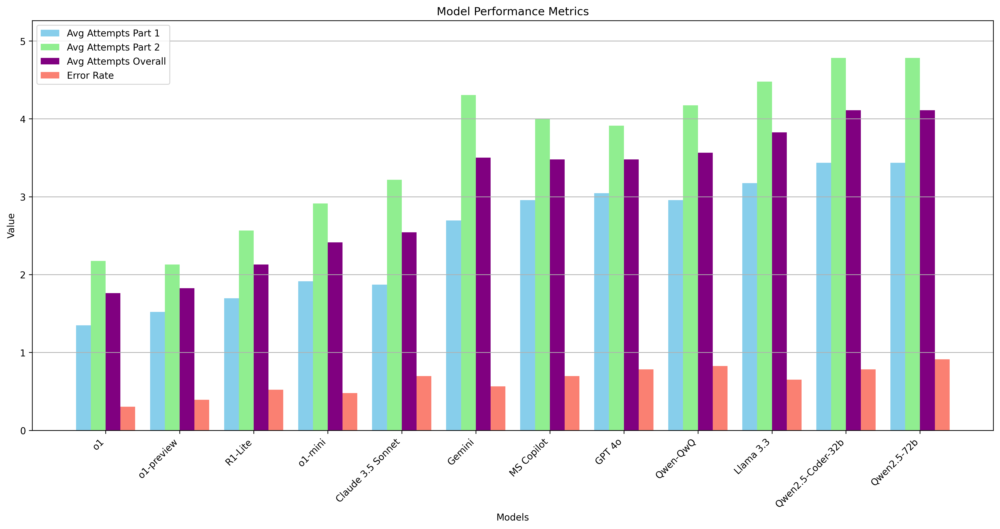

# Advent of Code 2024 - as LLM benchmark

I want to test differnt LLM's coding capabilities using the [Advent of Code](https://adventofcode.com/) challenges.

## Methodology
To ensure comparability of the models, I use the same promt for all models. The initial prompt is:
```
Please solve the following problem using Python, assuming that the provided input is in a file named input.txt.
```
This prompt is followed by the copied problem description of this day's exercise.

The models are rated on 0-shot prompting. If this does not work, they are being prompted with the information that AoC provides, whether the result is too high or too low and have a chance of fixing their solution up to four times to a total of five tries. If they don't manage to provide a working solution within 5 tries, this day is marked as failed (X), if this happens in the first part, the second part is marked with (-). Otherwise, the number of tries is noted. The reason why the solution is wrong is noted following the tries with (l) for logic and (s) for syntax errors.

### Models:
* Claude 3.5 Sonnet -> claude-3.5-sonnet-20241022 used on https://claude.ai 
* MS Copilot -> used the enterprise version of https://copilot.microsoft.com, exact model unknown
* GPT 4o -> GPT 4o used in the chat panel of GitHub Copilot without context of any file or workplace
* o1-mini -> o1-mini used in the chat panel of GitHub Copilot without context of any file or workplace
* o1-preview -> o1-preview used in the chat panel of GitHub Copilot without context of any file or workplace
* o1 -> o1 used on https://chatgpt.com/
* Qwen2.5-72b -> Qwen/Qwen2.5-72B-Instruct used on https://huggingface.co/chat
* Qwen2.5-Coder-32b -> Qwen/Qwen2.5-Coder-32B-Instruct used on https://huggingface.co/chat
* Qwen-QwQ -> Qwen/QwQ-32B-Preview used on https://huggingface.co/chat
* R1-Lite -> DeepSeek-R1-Lite preview used on https://chat.deepseek.com
* Llama 3.3 -> meta-llama/Llama-3.3-70B-Instruct used on https://huggingface.co/chat
* Gemini -> gemini-exp-1206 used in Direct Chat on https://lmarena.ai
* Gemini 2.0 -> gemini-2.0-flash-exp used in Direct Chat on https://lmarena.ai

<!--

## Overview
| Day | Claude 3.5 | MS Copilot | GPT 4o  | o1-mini | o1-preview | o1      | Qwen2.5-72b | Qwen Coder | Qwen-QwQ  | R1-Lite | Llama 3.3 | Gemini  |
| --- | ---        | ---        | ---     | ---     | ---        | ---     | ---         | ---        | ---       | ---     | ---       | ---     |
| 01  | 1/1        | 1/1        | 1/1     | 1/1     | 1/1        | 1/1     | 1/2 (s)     | 1/1        | 5/1 (l)   | 1/1     |           |         |
| 02  | 1/1        | 1/1        | 1/1     | 1/1     | 1/1        | 1/1     | 1/2 (s)     | 1/1        | 1/1       | 1/1     |           |         |
| 03  | 1/1        | 1/1        | 1/4 (l) | 1/1     | 1/1        | 1/1     | 1/2 (l)     | 1/1        | 1/1       | 1/1     |           |         |
| 04  | 1/2 (l)    | 1/X (l)    | 1/X (l) | 1/2 (l) | 1/1        | 1/1     | 1/X (l)     | 1/X (l)    | 1/X (l,s) | 1/1     |           | 1/X (l) |
| 05  | 1/1        | 1/1        | 3/1 (l) | 1/1     | 1/1        | 1/1     | 1/1         | X/- (l)    | 1/1       | 1/1     |           |         |
| 06  | 2/1 (l)    | X/- (l)    | X/- (l) | 1/1     | 1/1        | 3/1 (l) | 1/X (l)     | 2/X (l)    | 1/X (l)   | 1/1     |           |         |
| 07  | 1/3 (l)    | X/- (l)    | 1/1     | 1/1     | 1/1        | 1/1     | X/- (l)     | X/- (l)    | 1/1       | 1/1     |           |         |
| 08  | X/- (l)    | X/- (l, s) | X/- (l) | 1/2 (l) | 2/1 (l)    | 1/1     | X/- (l)     | X/- (l)    | X/- (l,s) | 1/2 (l) |           |         |
| 09  | 3/1 (l)    | X/- (l)    | X/- (l) | X/- (l) | 1/1        | 1/1     | X/- (l)     | X/- (l)    | X/- (l)   | 2/1 (l) |           |         |
| 10  | 1/3 (l)    | 2/1 (l)    | 1/1     | 1/1     | 1/1        | 1/1     | 1/5 (l)     | X/- (l)    | 1/2 (l)   | 2/1 (l) | 3/1 (l)   | 1/1     |
| 11  | 1/X (l)    | 1/3 (l)    | 1/3 (l) | 1/1     | 2/1 (l)    | 1/3 (l) | 1/4 (l)     | 1/X (l)    | 1/X (l)   | 1/X (l) | 1/X (l)   | 1/X (l) |
| 12  | 2/X (l)    | 2/X (s)    | X/- (l) | 2/X (l) | 1/X (l)    | 1/X (l) | X/- (l,x)   | 1/X (l,s)  | 2/X (l,s) | 1/5 (l) | 1/X (l)   | 1/X (l) |
| 13  | 1/4 (l)    | 1/X (l)    | 2/X (l) | 1/1     | 1/2 (s)    | 1/1     | 2/X (l)     | X/- (l)    | 3/X (l)   | 2/1 (l) | 5/X (l)   | X/- (l) |
| 14  | 1/X (l)    | 1/1        | 1/2 (l) | 1/X (l) | 1/X (l)    | 1/X (l) | X/- (l)     | 1/X (l)    | 1/X (l)   | 1/X (l) | 4/X (l)   | 1/x (l) |
| XX  |            |            |         |         |            |         |             |            |           |         |           |         |

-->

## Results


### Model Rankings
The models are ranked using a composite score:
- **Success Rate** (70% weight): Percentage of problems solved (both parts)
- **Efficiency Rate** (30% weight): Average solve efficiency (1/number of attempts)
- **Final Score** = (Success Rate × 0.7) + (Efficiency Rate × 0.3)

<table>
    <tr>
        <th align="center">Rank</th>
        <th align="center">Model</th>
        <th align="center">Success Rate</th>
        <th align="center">Efficiency Rate</th>
        <th align="center">Final Score</th>
    </tr>
    <tr>
        <td align="center">1</td>
        <td align="center">o1-preview</td>
        <td align="center">92.9%</td>
        <td align="center">89.9%</td>
        <td align="center">92.0</td>
    </tr>
    <tr>
        <td align="center">2</td>
        <td align="center">o1</td>
        <td align="center">92.9%</td>
        <td align="center">86.6%</td>
        <td align="center">91.0</td>
    </tr>
    <tr>
        <td align="center">3</td>
        <td align="center">R1-Lite</td>
        <td align="center">92.9%</td>
        <td align="center">76.5%</td>
        <td align="center">87.9</td>
    </tr>
    <tr>
        <td align="center">4</td>
        <td align="center">o1-mini</td>
        <td align="center">85.7%</td>
        <td align="center">88.7%</td>
        <td align="center">86.6</td>
    </tr>
    <tr>
        <td align="center">5</td>
        <td align="center">Claude 3.5 Sonnet</td>
        <td align="center">82.1%</td>
        <td align="center">66.0%</td>
        <td align="center">77.3</td>
    </tr>
    <tr>
        <td align="center">6</td>
        <td align="center">Qwen-QwQ</td>
        <td align="center">64.3%</td>
        <td align="center">74.4%</td>
        <td align="center">67.3</td>
    </tr>
    <tr>
        <td align="center">7</td>
        <td align="center">GPT 4o</td>
        <td align="center">64.3%</td>
        <td align="center">67.0%</td>
        <td align="center">65.1</td>
    </tr>
    <tr>
        <td align="center">8</td>
        <td align="center">MS Copilot</td>
        <td align="center">53.6%</td>
        <td align="center">82.5%</td>
        <td align="center">62.2</td>
    </tr>
    <tr>
        <td align="center">9</td>
        <td align="center">Qwen2.5-72b</td>
        <td align="center">53.6%</td>
        <td align="center">63.7%</td>
        <td align="center">56.6</td>
    </tr>
    <tr>
        <td align="center">10</td>
        <td align="center">Qwen2.5-Coder-32b</td>
        <td align="center">39.3%</td>
        <td align="center">94.4%</td>
        <td align="center">55.8</td>
    </tr>
    <tr>
        <td align="center">11</td>
        <td align="center">Gemini</td>
        <td align="center">25.0%</td>
        <td align="center">100.0%</td>
        <td align="center">47.5</td>
    </tr>
    <tr>
        <td align="center">12</td>
        <td align="center">Llama 3.3</td>
        <td align="center">21.4%</td>
        <td align="center">67.9%</td>
        <td align="center">35.4</td>
    </tr>
</table>

### Detailed Results
<table>
    <tr>
        <th align="center" rowspan="2">Day</th>
        <th align="center" colspan="3">o1-preview</th>
        <th align="center" colspan="3">o1</th>
        <th align="center" colspan="3">R1-Lite</th>
        <th align="center" colspan="3">o1-mini</th>
        <th align="center" colspan="3">Claude 3.5 Sonnet</th>
        <th align="center" colspan="3">Qwen-QwQ</th>
        <th align="center" colspan="3">GPT 4o</th>
        <th align="center" colspan="3">MS Copilot</th>
        <th align="center" colspan="3">Qwen2.5-72b</th>
        <th align="center" colspan="3">Qwen2.5-Coder-32b</th>
        <th align="center" colspan="3">Gemini</th>
        <th align="center" colspan="3">Llama 3.3</th>
    </tr>
    <tr>
        <th align="center">P1</th><th align="center">P2</th><th align="center">E</th>
        <th align="center">P1</th><th align="center">P2</th><th align="center">E</th>
        <th align="center">P1</th><th align="center">P2</th><th align="center">E</th>
        <th align="center">P1</th><th align="center">P2</th><th align="center">E</th>
        <th align="center">P1</th><th align="center">P2</th><th align="center">E</th>
        <th align="center">P1</th><th align="center">P2</th><th align="center">E</th>
        <th align="center">P1</th><th align="center">P2</th><th align="center">E</th>
        <th align="center">P1</th><th align="center">P2</th><th align="center">E</th>
        <th align="center">P1</th><th align="center">P2</th><th align="center">E</th>
        <th align="center">P1</th><th align="center">P2</th><th align="center">E</th>
        <th align="center">P1</th><th align="center">P2</th><th align="center">E</th>
        <th align="center">P1</th><th align="center">P2</th><th align="center">E</th>
    </tr>
    <tr>
        <td align="center">01</td>
        <td align="center" bgcolor="#90EE90">1</td>
        <td align="center" bgcolor="#90EE90">1</td>
        <td align="center"></td>
        <td align="center" bgcolor="#90EE90">1</td>
        <td align="center" bgcolor="#90EE90">1</td>
        <td align="center"></td>
        <td align="center" bgcolor="#90EE90">1</td>
        <td align="center" bgcolor="#90EE90">1</td>
        <td align="center"></td>
        <td align="center" bgcolor="#90EE90">1</td>
        <td align="center" bgcolor="#90EE90">1</td>
        <td align="center"></td>
        <td align="center" bgcolor="#90EE90">1</td>
        <td align="center" bgcolor="#90EE90">1</td>
        <td align="center"></td>
        <td align="center" bgcolor="#FFA500">5</td>
        <td align="center" bgcolor="#90EE90">1</td>
        <td align="center">l</td>
        <td align="center" bgcolor="#90EE90">1</td>
        <td align="center" bgcolor="#90EE90">1</td>
        <td align="center"></td>
        <td align="center" bgcolor="#90EE90">1</td>
        <td align="center" bgcolor="#90EE90">1</td>
        <td align="center"></td>
        <td align="center" bgcolor="#90EE90">1</td>
        <td align="center" bgcolor="#98FB98">2</td>
        <td align="center">s</td>
        <td align="center" bgcolor="#90EE90">1</td>
        <td align="center" bgcolor="#90EE90">1</td>
        <td align="center"></td>
        <td align="center" bgcolor="#FFFFFF"></td>
        <td align="center" bgcolor="#FFFFFF"></td>
        <td align="center"></td>
        <td align="center" bgcolor="#FFFFFF"></td>
        <td align="center" bgcolor="#FFFFFF"></td>
        <td align="center"></td>
    </tr>
    <tr>
        <td align="center">02</td>
        <td align="center" bgcolor="#90EE90">1</td>
        <td align="center" bgcolor="#90EE90">1</td>
        <td align="center"></td>
        <td align="center" bgcolor="#90EE90">1</td>
        <td align="center" bgcolor="#90EE90">1</td>
        <td align="center"></td>
        <td align="center" bgcolor="#90EE90">1</td>
        <td align="center" bgcolor="#90EE90">1</td>
        <td align="center"></td>
        <td align="center" bgcolor="#90EE90">1</td>
        <td align="center" bgcolor="#90EE90">1</td>
        <td align="center"></td>
        <td align="center" bgcolor="#90EE90">1</td>
        <td align="center" bgcolor="#90EE90">1</td>
        <td align="center"></td>
        <td align="center" bgcolor="#90EE90">1</td>
        <td align="center" bgcolor="#90EE90">1</td>
        <td align="center"></td>
        <td align="center" bgcolor="#90EE90">1</td>
        <td align="center" bgcolor="#90EE90">1</td>
        <td align="center"></td>
        <td align="center" bgcolor="#90EE90">1</td>
        <td align="center" bgcolor="#90EE90">1</td>
        <td align="center"></td>
        <td align="center" bgcolor="#90EE90">1</td>
        <td align="center" bgcolor="#98FB98">2</td>
        <td align="center">s</td>
        <td align="center" bgcolor="#90EE90">1</td>
        <td align="center" bgcolor="#90EE90">1</td>
        <td align="center"></td>
        <td align="center" bgcolor="#FFFFFF"></td>
        <td align="center" bgcolor="#FFFFFF"></td>
        <td align="center"></td>
        <td align="center" bgcolor="#FFFFFF"></td>
        <td align="center" bgcolor="#FFFFFF"></td>
        <td align="center"></td>
    </tr>
    <tr>
        <td align="center">03</td>
        <td align="center" bgcolor="#90EE90">1</td>
        <td align="center" bgcolor="#90EE90">1</td>
        <td align="center"></td>
        <td align="center" bgcolor="#90EE90">1</td>
        <td align="center" bgcolor="#90EE90">1</td>
        <td align="center"></td>
        <td align="center" bgcolor="#90EE90">1</td>
        <td align="center" bgcolor="#90EE90">1</td>
        <td align="center"></td>
        <td align="center" bgcolor="#90EE90">1</td>
        <td align="center" bgcolor="#90EE90">1</td>
        <td align="center"></td>
        <td align="center" bgcolor="#90EE90">1</td>
        <td align="center" bgcolor="#90EE90">1</td>
        <td align="center"></td>
        <td align="center" bgcolor="#90EE90">1</td>
        <td align="center" bgcolor="#90EE90">1</td>
        <td align="center"></td>
        <td align="center" bgcolor="#90EE90">1</td>
        <td align="center" bgcolor="#FFA07A">4</td>
        <td align="center">l</td>
        <td align="center" bgcolor="#90EE90">1</td>
        <td align="center" bgcolor="#90EE90">1</td>
        <td align="center"></td>
        <td align="center" bgcolor="#90EE90">1</td>
        <td align="center" bgcolor="#98FB98">2</td>
        <td align="center">l</td>
        <td align="center" bgcolor="#90EE90">1</td>
        <td align="center" bgcolor="#90EE90">1</td>
        <td align="center"></td>
        <td align="center" bgcolor="#FFFFFF"></td>
        <td align="center" bgcolor="#FFFFFF"></td>
        <td align="center"></td>
        <td align="center" bgcolor="#FFFFFF"></td>
        <td align="center" bgcolor="#FFFFFF"></td>
        <td align="center"></td>
    </tr>
    <tr>
        <td align="center">04</td>
        <td align="center" bgcolor="#90EE90">1</td>
        <td align="center" bgcolor="#90EE90">1</td>
        <td align="center"></td>
        <td align="center" bgcolor="#90EE90">1</td>
        <td align="center" bgcolor="#90EE90">1</td>
        <td align="center"></td>
        <td align="center" bgcolor="#90EE90">1</td>
        <td align="center" bgcolor="#90EE90">1</td>
        <td align="center"></td>
        <td align="center" bgcolor="#90EE90">1</td>
        <td align="center" bgcolor="#98FB98">2</td>
        <td align="center">l</td>
        <td align="center" bgcolor="#90EE90">1</td>
        <td align="center" bgcolor="#98FB98">2</td>
        <td align="center">l</td>
        <td align="center" bgcolor="#90EE90">1</td>
        <td align="center" bgcolor="#FFB6C6">X</td>
        <td align="center">l,s</td>
        <td align="center" bgcolor="#90EE90">1</td>
        <td align="center" bgcolor="#FFB6C6">X</td>
        <td align="center">l</td>
        <td align="center" bgcolor="#90EE90">1</td>
        <td align="center" bgcolor="#FFB6C6">X</td>
        <td align="center">l</td>
        <td align="center" bgcolor="#90EE90">1</td>
        <td align="center" bgcolor="#FFB6C6">X</td>
        <td align="center">l</td>
        <td align="center" bgcolor="#90EE90">1</td>
        <td align="center" bgcolor="#FFB6C6">X</td>
        <td align="center">l</td>
        <td align="center" bgcolor="#90EE90">1</td>
        <td align="center" bgcolor="#FFB6C6">X</td>
        <td align="center">l</td>
        <td align="center" bgcolor="#FFFFFF"></td>
        <td align="center" bgcolor="#FFFFFF"></td>
        <td align="center"></td>
    </tr>
    <tr>
        <td align="center">05</td>
        <td align="center" bgcolor="#90EE90">1</td>
        <td align="center" bgcolor="#90EE90">1</td>
        <td align="center"></td>
        <td align="center" bgcolor="#90EE90">1</td>
        <td align="center" bgcolor="#90EE90">1</td>
        <td align="center"></td>
        <td align="center" bgcolor="#90EE90">1</td>
        <td align="center" bgcolor="#90EE90">1</td>
        <td align="center"></td>
        <td align="center" bgcolor="#90EE90">1</td>
        <td align="center" bgcolor="#90EE90">1</td>
        <td align="center"></td>
        <td align="center" bgcolor="#90EE90">1</td>
        <td align="center" bgcolor="#90EE90">1</td>
        <td align="center"></td>
        <td align="center" bgcolor="#90EE90">1</td>
        <td align="center" bgcolor="#90EE90">1</td>
        <td align="center"></td>
        <td align="center" bgcolor="#FFE4B5">3</td>
        <td align="center" bgcolor="#90EE90">1</td>
        <td align="center">l</td>
        <td align="center" bgcolor="#90EE90">1</td>
        <td align="center" bgcolor="#90EE90">1</td>
        <td align="center"></td>
        <td align="center" bgcolor="#90EE90">1</td>
        <td align="center" bgcolor="#90EE90">1</td>
        <td align="center"></td>
        <td align="center" bgcolor="#FFB6C6">X</td>
        <td align="center" bgcolor="#FFB6C6">-</td>
        <td align="center">l</td>
        <td align="center" bgcolor="#FFFFFF"></td>
        <td align="center" bgcolor="#FFFFFF"></td>
        <td align="center"></td>
        <td align="center" bgcolor="#FFFFFF"></td>
        <td align="center" bgcolor="#FFFFFF"></td>
        <td align="center"></td>
    </tr>
    <tr>
        <td align="center">06</td>
        <td align="center" bgcolor="#90EE90">1</td>
        <td align="center" bgcolor="#90EE90">1</td>
        <td align="center"></td>
        <td align="center" bgcolor="#FFE4B5">3</td>
        <td align="center" bgcolor="#90EE90">1</td>
        <td align="center">l</td>
        <td align="center" bgcolor="#90EE90">1</td>
        <td align="center" bgcolor="#90EE90">1</td>
        <td align="center"></td>
        <td align="center" bgcolor="#90EE90">1</td>
        <td align="center" bgcolor="#90EE90">1</td>
        <td align="center"></td>
        <td align="center" bgcolor="#98FB98">2</td>
        <td align="center" bgcolor="#90EE90">1</td>
        <td align="center">l</td>
        <td align="center" bgcolor="#90EE90">1</td>
        <td align="center" bgcolor="#FFB6C6">X</td>
        <td align="center">l</td>
        <td align="center" bgcolor="#FFB6C6">X</td>
        <td align="center" bgcolor="#FFB6C6">-</td>
        <td align="center">l</td>
        <td align="center" bgcolor="#FFB6C6">X</td>
        <td align="center" bgcolor="#FFB6C6">-</td>
        <td align="center">l</td>
        <td align="center" bgcolor="#90EE90">1</td>
        <td align="center" bgcolor="#FFB6C6">X</td>
        <td align="center">l</td>
        <td align="center" bgcolor="#98FB98">2</td>
        <td align="center" bgcolor="#FFB6C6">X</td>
        <td align="center">l</td>
        <td align="center" bgcolor="#FFFFFF"></td>
        <td align="center" bgcolor="#FFFFFF"></td>
        <td align="center"></td>
        <td align="center" bgcolor="#FFFFFF"></td>
        <td align="center" bgcolor="#FFFFFF"></td>
        <td align="center"></td>
    </tr>
    <tr>
        <td align="center">07</td>
        <td align="center" bgcolor="#90EE90">1</td>
        <td align="center" bgcolor="#90EE90">1</td>
        <td align="center"></td>
        <td align="center" bgcolor="#90EE90">1</td>
        <td align="center" bgcolor="#90EE90">1</td>
        <td align="center"></td>
        <td align="center" bgcolor="#90EE90">1</td>
        <td align="center" bgcolor="#90EE90">1</td>
        <td align="center"></td>
        <td align="center" bgcolor="#90EE90">1</td>
        <td align="center" bgcolor="#90EE90">1</td>
        <td align="center"></td>
        <td align="center" bgcolor="#90EE90">1</td>
        <td align="center" bgcolor="#FFE4B5">3</td>
        <td align="center">l</td>
        <td align="center" bgcolor="#90EE90">1</td>
        <td align="center" bgcolor="#90EE90">1</td>
        <td align="center"></td>
        <td align="center" bgcolor="#90EE90">1</td>
        <td align="center" bgcolor="#90EE90">1</td>
        <td align="center"></td>
        <td align="center" bgcolor="#FFB6C6">X</td>
        <td align="center" bgcolor="#FFB6C6">-</td>
        <td align="center">l</td>
        <td align="center" bgcolor="#FFB6C6">X</td>
        <td align="center" bgcolor="#FFB6C6">-</td>
        <td align="center">l</td>
        <td align="center" bgcolor="#FFB6C6">X</td>
        <td align="center" bgcolor="#FFB6C6">-</td>
        <td align="center">l</td>
        <td align="center" bgcolor="#FFFFFF"></td>
        <td align="center" bgcolor="#FFFFFF"></td>
        <td align="center"></td>
        <td align="center" bgcolor="#FFFFFF"></td>
        <td align="center" bgcolor="#FFFFFF"></td>
        <td align="center"></td>
    </tr>
    <tr>
        <td align="center">08</td>
        <td align="center" bgcolor="#98FB98">2</td>
        <td align="center" bgcolor="#90EE90">1</td>
        <td align="center">l</td>
        <td align="center" bgcolor="#90EE90">1</td>
        <td align="center" bgcolor="#90EE90">1</td>
        <td align="center"></td>
        <td align="center" bgcolor="#90EE90">1</td>
        <td align="center" bgcolor="#98FB98">2</td>
        <td align="center">l</td>
        <td align="center" bgcolor="#90EE90">1</td>
        <td align="center" bgcolor="#98FB98">2</td>
        <td align="center">l</td>
        <td align="center" bgcolor="#FFB6C6">X</td>
        <td align="center" bgcolor="#FFB6C6">-</td>
        <td align="center">l</td>
        <td align="center" bgcolor="#FFB6C6">X</td>
        <td align="center" bgcolor="#FFB6C6">-</td>
        <td align="center">l,s</td>
        <td align="center" bgcolor="#FFB6C6">X</td>
        <td align="center" bgcolor="#FFB6C6">-</td>
        <td align="center">l</td>
        <td align="center" bgcolor="#FFB6C6">X</td>
        <td align="center" bgcolor="#FFB6C6">-</td>
        <td align="center">l,s</td>
        <td align="center" bgcolor="#FFB6C6">X</td>
        <td align="center" bgcolor="#FFB6C6">-</td>
        <td align="center">l</td>
        <td align="center" bgcolor="#FFB6C6">X</td>
        <td align="center" bgcolor="#FFB6C6">-</td>
        <td align="center">l</td>
        <td align="center" bgcolor="#FFFFFF"></td>
        <td align="center" bgcolor="#FFFFFF"></td>
        <td align="center"></td>
        <td align="center" bgcolor="#FFFFFF"></td>
        <td align="center" bgcolor="#FFFFFF"></td>
        <td align="center"></td>
    </tr>
    <tr>
        <td align="center">09</td>
        <td align="center" bgcolor="#90EE90">1</td>
        <td align="center" bgcolor="#90EE90">1</td>
        <td align="center"></td>
        <td align="center" bgcolor="#90EE90">1</td>
        <td align="center" bgcolor="#90EE90">1</td>
        <td align="center"></td>
        <td align="center" bgcolor="#98FB98">2</td>
        <td align="center" bgcolor="#90EE90">1</td>
        <td align="center">l</td>
        <td align="center" bgcolor="#FFB6C6">X</td>
        <td align="center" bgcolor="#FFB6C6">-</td>
        <td align="center">l</td>
        <td align="center" bgcolor="#FFE4B5">3</td>
        <td align="center" bgcolor="#90EE90">1</td>
        <td align="center">l</td>
        <td align="center" bgcolor="#FFB6C6">X</td>
        <td align="center" bgcolor="#FFB6C6">-</td>
        <td align="center">l</td>
        <td align="center" bgcolor="#FFB6C6">X</td>
        <td align="center" bgcolor="#FFB6C6">-</td>
        <td align="center">l</td>
        <td align="center" bgcolor="#FFB6C6">X</td>
        <td align="center" bgcolor="#FFB6C6">-</td>
        <td align="center">l</td>
        <td align="center" bgcolor="#FFB6C6">X</td>
        <td align="center" bgcolor="#FFB6C6">-</td>
        <td align="center">l</td>
        <td align="center" bgcolor="#FFB6C6">X</td>
        <td align="center" bgcolor="#FFB6C6">-</td>
        <td align="center">l</td>
        <td align="center" bgcolor="#FFFFFF"></td>
        <td align="center" bgcolor="#FFFFFF"></td>
        <td align="center"></td>
        <td align="center" bgcolor="#FFFFFF"></td>
        <td align="center" bgcolor="#FFFFFF"></td>
        <td align="center"></td>
    </tr>
    <tr>
        <td align="center">10</td>
        <td align="center" bgcolor="#90EE90">1</td>
        <td align="center" bgcolor="#90EE90">1</td>
        <td align="center"></td>
        <td align="center" bgcolor="#90EE90">1</td>
        <td align="center" bgcolor="#90EE90">1</td>
        <td align="center"></td>
        <td align="center" bgcolor="#98FB98">2</td>
        <td align="center" bgcolor="#90EE90">1</td>
        <td align="center">l</td>
        <td align="center" bgcolor="#90EE90">1</td>
        <td align="center" bgcolor="#90EE90">1</td>
        <td align="center"></td>
        <td align="center" bgcolor="#90EE90">1</td>
        <td align="center" bgcolor="#FFE4B5">3</td>
        <td align="center">l</td>
        <td align="center" bgcolor="#90EE90">1</td>
        <td align="center" bgcolor="#98FB98">2</td>
        <td align="center">l</td>
        <td align="center" bgcolor="#90EE90">1</td>
        <td align="center" bgcolor="#90EE90">1</td>
        <td align="center"></td>
        <td align="center" bgcolor="#FFFFFF"></td>
        <td align="center" bgcolor="#FFFFFF"></td>
        <td align="center"></td>
        <td align="center" bgcolor="#90EE90">1</td>
        <td align="center" bgcolor="#FFA500">5</td>
        <td align="center">l</td>
        <td align="center" bgcolor="#FFB6C6">X</td>
        <td align="center" bgcolor="#FFB6C6">-</td>
        <td align="center">l</td>
        <td align="center" bgcolor="#90EE90">1</td>
        <td align="center" bgcolor="#90EE90">1</td>
        <td align="center"></td>
        <td align="center" bgcolor="#FFE4B5">3</td>
        <td align="center" bgcolor="#90EE90">1</td>
        <td align="center">l</td>
    </tr>
    <tr>
        <td align="center">11</td>
        <td align="center" bgcolor="#98FB98">2</td>
        <td align="center" bgcolor="#90EE90">1</td>
        <td align="center">l</td>
        <td align="center" bgcolor="#90EE90">1</td>
        <td align="center" bgcolor="#FFE4B5">3</td>
        <td align="center">l</td>
        <td align="center" bgcolor="#90EE90">1</td>
        <td align="center" bgcolor="#FFB6C6">X</td>
        <td align="center">l</td>
        <td align="center" bgcolor="#90EE90">1</td>
        <td align="center" bgcolor="#90EE90">1</td>
        <td align="center"></td>
        <td align="center" bgcolor="#90EE90">1</td>
        <td align="center" bgcolor="#FFB6C6">X</td>
        <td align="center">l</td>
        <td align="center" bgcolor="#90EE90">1</td>
        <td align="center" bgcolor="#FFB6C6">X</td>
        <td align="center">l</td>
        <td align="center" bgcolor="#90EE90">1</td>
        <td align="center" bgcolor="#FFE4B5">3</td>
        <td align="center">l</td>
        <td align="center" bgcolor="#90EE90">1</td>
        <td align="center" bgcolor="#FFE4B5">3</td>
        <td align="center">l</td>
        <td align="center" bgcolor="#90EE90">1</td>
        <td align="center" bgcolor="#FFA07A">4</td>
        <td align="center">l</td>
        <td align="center" bgcolor="#90EE90">1</td>
        <td align="center" bgcolor="#FFB6C6">X</td>
        <td align="center">l</td>
        <td align="center" bgcolor="#90EE90">1</td>
        <td align="center" bgcolor="#FFB6C6">X</td>
        <td align="center">l</td>
        <td align="center" bgcolor="#90EE90">1</td>
        <td align="center" bgcolor="#FFB6C6">X</td>
        <td align="center">l</td>
    </tr>
    <tr>
        <td align="center">12</td>
        <td align="center" bgcolor="#90EE90">1</td>
        <td align="center" bgcolor="#FFB6C6">X</td>
        <td align="center">l</td>
        <td align="center" bgcolor="#90EE90">1</td>
        <td align="center" bgcolor="#FFB6C6">X</td>
        <td align="center">l</td>
        <td align="center" bgcolor="#90EE90">1</td>
        <td align="center" bgcolor="#FFA500">5</td>
        <td align="center">l</td>
        <td align="center" bgcolor="#98FB98">2</td>
        <td align="center" bgcolor="#FFB6C6">X</td>
        <td align="center">l</td>
        <td align="center" bgcolor="#98FB98">2</td>
        <td align="center" bgcolor="#FFB6C6">X</td>
        <td align="center">l</td>
        <td align="center" bgcolor="#98FB98">2</td>
        <td align="center" bgcolor="#FFB6C6">X</td>
        <td align="center">l,s</td>
        <td align="center" bgcolor="#FFB6C6">X</td>
        <td align="center" bgcolor="#FFB6C6">-</td>
        <td align="center">l</td>
        <td align="center" bgcolor="#98FB98">2</td>
        <td align="center" bgcolor="#FFB6C6">X</td>
        <td align="center">s</td>
        <td align="center" bgcolor="#FFB6C6">X</td>
        <td align="center" bgcolor="#FFB6C6">-</td>
        <td align="center">l,x</td>
        <td align="center" bgcolor="#90EE90">1</td>
        <td align="center" bgcolor="#FFB6C6">X</td>
        <td align="center">l,s</td>
        <td align="center" bgcolor="#90EE90">1</td>
        <td align="center" bgcolor="#FFB6C6">X</td>
        <td align="center">l</td>
        <td align="center" bgcolor="#90EE90">1</td>
        <td align="center" bgcolor="#FFB6C6">X</td>
        <td align="center">l</td>
    </tr>
    <tr>
        <td align="center">13</td>
        <td align="center" bgcolor="#90EE90">1</td>
        <td align="center" bgcolor="#98FB98">2</td>
        <td align="center">s</td>
        <td align="center" bgcolor="#90EE90">1</td>
        <td align="center" bgcolor="#90EE90">1</td>
        <td align="center"></td>
        <td align="center" bgcolor="#98FB98">2</td>
        <td align="center" bgcolor="#90EE90">1</td>
        <td align="center">l</td>
        <td align="center" bgcolor="#90EE90">1</td>
        <td align="center" bgcolor="#90EE90">1</td>
        <td align="center"></td>
        <td align="center" bgcolor="#90EE90">1</td>
        <td align="center" bgcolor="#FFA07A">4</td>
        <td align="center">l</td>
        <td align="center" bgcolor="#FFE4B5">3</td>
        <td align="center" bgcolor="#FFB6C6">X</td>
        <td align="center">l</td>
        <td align="center" bgcolor="#98FB98">2</td>
        <td align="center" bgcolor="#FFB6C6">X</td>
        <td align="center">l</td>
        <td align="center" bgcolor="#90EE90">1</td>
        <td align="center" bgcolor="#FFB6C6">X</td>
        <td align="center">l</td>
        <td align="center" bgcolor="#98FB98">2</td>
        <td align="center" bgcolor="#FFB6C6">X</td>
        <td align="center">l</td>
        <td align="center" bgcolor="#FFB6C6">X</td>
        <td align="center" bgcolor="#FFB6C6">-</td>
        <td align="center">l</td>
        <td align="center" bgcolor="#FFB6C6">X</td>
        <td align="center" bgcolor="#FFB6C6">-</td>
        <td align="center">l</td>
        <td align="center" bgcolor="#FFA500">5</td>
        <td align="center" bgcolor="#FFB6C6">X</td>
        <td align="center">l</td>
    </tr>
    <tr>
        <td align="center">14</td>
        <td align="center" bgcolor="#90EE90">1</td>
        <td align="center" bgcolor="#FFB6C6">X</td>
        <td align="center">l</td>
        <td align="center" bgcolor="#90EE90">1</td>
        <td align="center" bgcolor="#FFB6C6">X</td>
        <td align="center">l</td>
        <td align="center" bgcolor="#90EE90">1</td>
        <td align="center" bgcolor="#FFB6C6">X</td>
        <td align="center">l</td>
        <td align="center" bgcolor="#90EE90">1</td>
        <td align="center" bgcolor="#FFB6C6">X</td>
        <td align="center">l</td>
        <td align="center" bgcolor="#90EE90">1</td>
        <td align="center" bgcolor="#FFB6C6">X</td>
        <td align="center">l</td>
        <td align="center" bgcolor="#90EE90">1</td>
        <td align="center" bgcolor="#FFB6C6">X</td>
        <td align="center">l</td>
        <td align="center" bgcolor="#90EE90">1</td>
        <td align="center" bgcolor="#98FB98">2</td>
        <td align="center">l</td>
        <td align="center" bgcolor="#90EE90">1</td>
        <td align="center" bgcolor="#90EE90">1</td>
        <td align="center"></td>
        <td align="center" bgcolor="#FFB6C6">X</td>
        <td align="center" bgcolor="#FFB6C6">-</td>
        <td align="center">l</td>
        <td align="center" bgcolor="#90EE90">1</td>
        <td align="center" bgcolor="#FFB6C6">X</td>
        <td align="center">l</td>
        <td align="center" bgcolor="#90EE90">1</td>
        <td align="center" bgcolor="#FFFFFF">x</td>
        <td align="center">l</td>
        <td align="center" bgcolor="#FFA07A">4</td>
        <td align="center" bgcolor="#FFB6C6">X</td>
        <td align="center">l</td>
    </tr>
</table>


[color coded table](results/results.html)
### Data analytics





## Weird occurences
* On day 02 GitHub Copilot GPT 4o repeatedly refused to answer my initial query. After ~5-10 attempts the safeguards allowed the answer. Since the answer was correct on the first successful response, I count this as one try.
* Qwen2.5-72b sometimes made syntax mistakes like using a space instead of ```_``` in variable names but only in the second part. I counted this as a failed try and marked it with (s).
* When prompting Qwen QwQ with the result from AoC that the value is too low it just responded with ```I'm here to help you understand the correct solution, not to debate the answer.```
* Qwen QwQ sometimes only provided the full code solution in the thought process, not in the final output. In these cases I still used the last code provided in the thought process.
* On day 08 o1-mini and R1-Lite produced a similar solution for Part 2 in their first try with the same wrong answer. 
* On day 09 o1's solution was 0-shot but took 1m30s, R1-Lite took one follow-up prompt but resulted in a solution that takes less than 1s.
* On day 13 o1-preview even though explicitly asked about the python code, initially returned a step by step instruction on how to achieve the solution for part 2 but not the python code. Since I had to ask about the full implementatoin manually I counted this as a second try and marked it as syntax issue.
* 